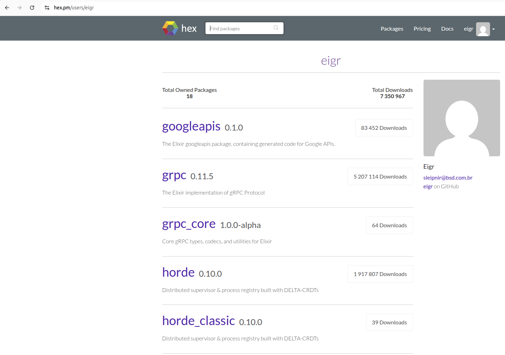

<!-- _class: lead -->
<!-- _backgroundColor: #663399 -->
<!-- _color: white -->

# 🌊 Streaming-first
## A Evolução do elixir-grpc

### Adriano Santos
**Elixir BH Meetup · Janeiro 2026**

---

# Quem sou eu?

**Adriano Santos**

- Gerente de Desenvolvimento na V3 Tecnologia
- Contribuidor ativo em projetos open source:
  - **elixir-grpc**,**honey-potion**, **spawn**, **horde**, ...
  - Dentro e fora do ecossistema Elixir
- Apaixonado por sistemas distribuídos, streaming e comunidades técnicas

---

# Código: Impacto, Pessoas e Responsabilidade 



---

# Agenda

### O que vamos ver hoje:

| Tópico | Descrição |                               |
|--------|-----------|-------------------------------|
| 📚 **Contexto**    | O que é elixir-grpc           |
| 💡 **Conceito**    | Por que Streaming-first?      |
| 🔧 **Fundamentos** | API GRPC.Stream em detalhes   |
| 💻 **Prática**     | Exemplos reais e casos de uso |
| 🚀 **Evolução**    | Mudanças e próximos passos    |

---

# gRPC

---

* gRPC é um framework de RPC, criado pelo Google, que usa HTTP/2 e Protobuf para comunicação eficiente, tipada e multiplataforma entre serviços.
* Liberado como projeto open source em fevereiro de 2015.
* Antes de ser aberto ao público, o gRPC já existia internamente no Google como uma evolução do Stubby, a infraestrutura RPC usada pelos serviços da empresa.

**Características:**
- HTTP/2 (multiplexing, compressão)
- Protocol Buffers (serialização tipada)
- TLS e autenticação

**Quatro tipos de RPC:**
`Unary` · `Server Stream` · `Client Stream` · `Bidirectional`

**Características:** Idiomático · Escalável · Orientado a Contratos

---

# Tipos de streaming no gRPC

| Tipo                 | Descrição              | Fluxo                        |
|----------------------|------------------------|------------------------------|
| **Unary**            | Request/Response único | Cliente → Servidor → Cliente |
| **Server Streaming** | Servidor envia stream  | Cliente → Servidor ⇉ Cliente |
| **Client Streaming** | Cliente envia stream   | Cliente ⇉ Servidor → Cliente |
| **Bidirectional**    | Ambos streamam         | Cliente ⇄ Servidor           |

---

# Definição de contratos gRPC

```protobuf
syntax = "proto3";
package delivery;

message OrderRequest {
  string customer_id = 1;
  string restaurant_id = 2;
  repeated string items = 3;
}

message OrderResponse {
  string order_id = 1;
  string status = 2;
}

// Serviço de Pedidos
service OrderService {
  // Unary: Cliente faz um pedido
  rpc CreateOrder(OrderRequest) returns (OrderResponse);

  // Server Streaming: Cliente acompanha status do pedido em tempo real
  rpc TrackOrder(TrackRequest) returns (stream OrderStatus);

  // Client Streaming: Restaurante envia items do pedido um por um
  rpc PrepareOrder(stream OrderItem) returns (PreparationSummary);

  // Bidirectional: Chat entre cliente e entregador
  rpc OrderChat(stream ChatMessage) returns (stream ChatMessage);
}

```

---

# Elixir gRPC

---

* Primeiro commit público em 32 de Julho de 2016 por Tony Han (tony612)
* Longo **hiatus** sem grandes atualizações e/ou correções
* **Paulo Valente** assume a manutenção do projeto
* Eu entro um tempo depois

Hoje os principais mantenedores são:
  - **Paulo Valente**
  - **Adriano Santos** ***(Eu)***
  - **Dave Lucia**
  - **Bing Han**

---

# O problema do modelo tradicional

- gRPC tratado como request/response
- Streams como exceção
- APIs imperativas
- Baixa composabilidade

---

# Streaming-first

**Streams não são um detalhe**

- Unary = stream de 1 elemento
- Tudo é fluxo
- Composição funcional

---

# O papel do GRPC.Stream

- **Abstração baseada em Flow**
- Suporte a backpressure via GenStage
- Transformações funcionais
- Composição de pipelines
- Integração com produtores externos (RabbitMQ, Kafka)

---

# Estrutura da API

* **Funções de Criação:**
  - `from/2` - Converte um input stream em Flow com backpressure
  - `unary/2` - Converte request única em Flow
* **Operadores:**
  - `map/2`, `filter/2`, `flat_map/2`
  - `map_with_context/2`, `map_error/2`
  - `reduce/3`, `partition/1`
  - `uniq/1`, `uniq_by/2`
* **Materializadores:**
  - `run/1` - Executa stream unary
  - `run_with/3` - Executa e emite respostas de um stream

---

# Unary como stream

```elixir
def say_hello(request, materializer) do
  GRPC.Stream.unary(request, materializer: materializer)
  |> GRPC.Stream.map(fn %HelloRequest{name: name} ->
    %HelloReply{message: "Hello, #{name}!"}
  end)
  |> GRPC.Stream.run()
end
```

**Conceito:** Unary é apenas um stream de 1 elemento

---

# Server-side streaming

```elixir
def stream_numbers(request, materializer) do
  Stream.repeatedly(fn ->
    %NumberReply{value: :rand.uniform(100)}
  end)
  |> Stream.take(5)
  |> GRPC.Stream.from()
  |> GRPC.Stream.run_with(materializer)
end
```

**Cliente envia uma mensagem, Servidor envia múltiplas mensagens**

---

# Client-side streaming

```elixir
def sum_numbers(input_stream, materializer) do
  GRPC.Stream.from(input_stream)
  |> GRPC.Stream.reduce(
    fn -> 0 end,
    fn %Number{value: v}, acc -> acc + v end
  )
  |> GRPC.Stream.map(fn sum ->
    %SumReply{total: sum}
  end)
  |> GRPC.Stream.run_with(materializer)
end
```

**Cliente envia múltiplas mensagens, servidor responde uma vez**

---

# Bidirectional streaming

```elixir
def route_chat(input, materializer) do
  {:ok, server_producer} = MyApp.EventProducer.start_link([])
  
  # Combina input do cliente + eventos independentes do servidor
  GRPC.Stream.from(input, join_with: server_producer)
  |> GRPC.Stream.map(fn
    %RouteNote{} = note -> 
      %RouteNote{message: "Echo: #{note.message}"}
    
    # Eventos independentes do servidor
    {:server_event, data} ->
      %RouteNote{message: "Server says: #{data}"}
  end)
  |> GRPC.Stream.run_with(materializer)
end
```

**Servidor pode enviar mensagens a qualquer momento, independente do cliente**

---

# Operadores: map, filter, flat_map

```elixir
def process_events(input, materializer) do
  GRPC.Stream.from(input)
  |> GRPC.Stream.filter(fn event -> event.priority >= 5 end)
  |> GRPC.Stream.map(fn event ->
    %Event{id: event.id, data: String.upcase(event.data)}
  end)
  |> GRPC.Stream.flat_map(fn event ->
    # Emite múltiplas respostas para cada entrada
    [event, %Event{id: "#{event.id}-copy", data: event.data}]
  end)
  |> GRPC.Stream.run_with(materializer)
end
```

---

# Tratamento de erros no gRPC

**Desafio:** Streams podem falhar de diversas formas
- Exceções durante processamento
- Validações que falham
- Timeouts de serviços externos
- Erros de parsing/codificação

**Solução:** `map_error/2` captura e transforma erros

**Tipos de erro capturados:**
```elixir
{:error, reason}                    # Erros explícitos
{:error, {:exception, exception}}   # Exceções lançadas
{:error, {kind, reason}}            # throw/exit
```

---

# map_error: Lidando com erros durante o fluxo

```elixir
def safe_processing(input, materializer) do
  GRPC.Stream.from(input)
  |> GRPC.Stream.map(fn data ->
    # Validação pode lançar exceção
    if data.value < 0, do: raise("Negative value!")
    
    # Processamento pode falhar
    process(data)
  end)
  |> GRPC.Stream.map_error(fn
    # Captura exceções
    {:error, {:exception, %RuntimeError{message: msg}}} ->
      GRPC.RPCError.exception(
        status: :invalid_argument,
        message: "Validation failed: #{msg}"
      )
    
    # Qualquer outro erro
    {:error, reason} ->  GRPC.RPCError.exception(status: :internal, message: "Processing error: #{inspect(reason)}")

    item -> item 
  end)
  |> GRPC.Stream.run_with(materializer)
end
```

---

# Estratégias de tratamento de erros

---

**1. Fail-fast - Para o stream no primeiro erro:**
```elixir
# Sem map_error - primeira exceção interrompe tudo
GRPC.Stream.from(input)
|> GRPC.Stream.map(&may_fail/1)
|> GRPC.Stream.run_with(materializer)
```

---

**2. Transformar erros em respostas válidas:**
```elixir
# Continua processando mesmo com erros
GRPC.Stream.from(input)
|> GRPC.Stream.map(&may_fail/1)
|> GRPC.Stream.map_error(
  fn {:error, _} -> %Response{status: "error", data: nil}
  item -> item
end)
|> GRPC.Stream.run_with(materializer)
```
---

**3. Retry com fallback:**
```elixir
GRPC.Stream.from(input)
|> GRPC.Stream.map(fn item ->
  case retry_operation(item, attempts: 3) do
    {:ok, result} -> result
    {:error, reason} -> {:error, reason}
  end
end)
|> GRPC.Stream.map_error(&handle_persistent_failure/1)
|> GRPC.Stream.run_with(materializer)
```

---

# Side-effects: effect

```elixir
def stream_with_effects(input, materializer) do
  # Pode ser um GenServer, Agent, ou qualquer processo ou função
  {:ok, metrics_collector} = MetricsCollector.start_link()
  {:ok, notifier} = EventNotifier.start_link()
  
  GRPC.Stream.from(input)
  |> GRPC.Stream.effect(fn msg ->
    # Logging
    Logger.info("Processing: #{inspect(msg)}")
  end)
  |> GRPC.Stream.map(&transform/1)
  |> GRPC.Stream.effect(fn result ->
    # Envia mensagem para processo coletor de métricas
    send(metrics_collector, {:metric, :processed, 1})
    
    # Notifica outros processos
    send(notifier, {:event, :item_processed, result})
  end)
  |> GRPC.Stream.run_with(materializer)
end
```

---

# effect: Casos de uso comuns

```elixir
def monitored_stream(input, materializer) do  
  GRPC.Stream.from(input)
  # 1. Debug/Observabilidade
  |> GRPC.Stream.effect(fn item ->
    IO.inspect(item, label: "Stream item")
  end)
  
  # 2. Telemetry events
  |> GRPC.Stream.effect(fn item ->
    :telemetry.execute([:app, :stream, :item], %{count: 1}, %{type: item.__struct__})
  end)
  
  # 3. Notificar processo externo
  |> GRPC.Stream.effect(fn item ->
    send(some_pid, {:item_seen, item.id})
  end)
  
  # 4. Cachear valores
  |> GRPC.Stream.effect(fn item ->
    Cache.put("item:#{item.id}", item)
  end)
  
  |> GRPC.Stream.map(&process/1)
  |> GRPC.Stream.run_with(materializer)
end
```

---

# Composição de streams

```elixir
def pipeline(input, materializer) do
  input
  |> GRPC.Stream.from(max_demand: 20)
  |> validate_input()
  |> enrich_with_data()
  |> persist_to_db()
  |> format_response()
  |> GRPC.Stream.run_with(materializer)
end

defp validate_input(stream) do
  GRPC.Stream.filter(stream, &valid?/1)
end

defp enrich_with_data(stream) do
  GRPC.Stream.map(stream, &fetch_metadata/1)
end
```

---

# Backpressure e max_demand

```elixir
def controlled_stream(input, materializer) do
  # Limita demanda para evitar sobrecarga
  GRPC.Stream.from(input, max_demand: 10)
  |> GRPC.Stream.map(&expensive_operation/1)
  |> GRPC.Stream.run_with(materializer)
end
```

**max_demand controla quantos itens são solicitados por vez**
- Evita sobrecarga de memória
- Controla taxa de processamento
- GenStage gerencia automaticamente

---

# Integração com produtores externos

```elixir
def stream_from_queue(input, materializer) do
  # Inicia producer externo (RabbitMQ, Kafka, etc)
  {:ok, queue_pid} = MyApp.RabbitMQ.Producer.start_link([])
  
  GRPC.Stream.from(input, 
    join_with: queue_pid,
    max_demand: 10
  )
  |> GRPC.Stream.map(&handle_message/1)
  |> GRPC.Stream.run_with(materializer)
end

defp handle_message({_, msg}), do: msg
defp handle_message(event), do: %Event{data: inspect(event)}
```

**:join_with permite mesclar streams gRPC com fontes externas**

---

# Contexto e Headers

```elixir
def authenticated_stream(input, materializer) do
  headers = GRPC.Stream.get_headers(materializer)
  
  GRPC.Stream.from(input, materializer: materializer)
  |> GRPC.Stream.map_with_context(fn headers, msg ->
    user = headers["user-id"]
    authorize(user, msg)
  end)
  |> GRPC.Stream.run_with(materializer)
end
```

**Acesso a headers HTTP/2 e contexto da requisição**

---

# ask: Comunicação síncrona com Processos

```elixir
def enrich_with_prices(input, materializer) do
  # isto provavelmente estaria em outro lugar
  {:ok, pricing_pid} = PricingService.start_link([])

  GRPC.Stream.from(input)
  # Consulta o GenServer para cada produto
  |> GRPC.Stream.ask(pricing_pid, timeout: 5000)
  |> GRPC.Stream.map(fn
    # Sucesso: enriquece o produto com preço
    {:response, price} -> %ProductReply{price: price, status: :available}
    
    # Timeout: serviço não respondeu
    {:error, :timeout} -> %ProductReply{price: 0.0, status: :unavailable}
    
    # Processo morreu
    {:error, :process_not_alive} -> %ProductReply{price: 0.0, status: :error}
  end)
  |> GRPC.Stream.run_with(materializer)
end
```

**ask/3 mantém o fluxo enquanto consulta serviços externos**

---

# ask: Integrando um Processo com o stream

```elixir
defmodule PricingService do
  use GenServer

  def start_link(_opts) do
    GenServer.start_link(__MODULE__, %{}, name: __MODULE__)
  end

  def init(_), do: {:ok, %{}}

  # Recebe {:request, item, from} e responde {:response, result}
  def handle_info({:request, %Product{id: id}, from}, state) do
    # Consulta preço no banco, cache, API externa, etc.
    price = calculate_price(id)
    send(from, {:response, price})
    {:noreply, state}
  end

  defp calculate_price(id), do: :rand.uniform(100) * 1.0
end
```

---

# Exemplo: Enriquecimento com múltiplos serviços

```elixir
def enrich_product_stream(input, materializer) do
  {:ok, pricing} = PricingService.start_link([])
  {:ok, inventory} = InventoryService.start_link([])
  
  GRPC.Stream.from(input)
  # Consulta preço
  |> GRPC.Stream.ask(pricing, timeout: 2000)
  |> GRPC.Stream.map(fn
    {:response, price} -> {:ok, price}
    {:error, _} -> {:ok, 0.0}  # fallback
  end)
  # Consulta estoque
  |> GRPC.Stream.ask(inventory, timeout: 2000)
  |> GRPC.Stream.map(fn
    {:response, stock} -> %ProductReply{price: price, stock: stock}
    {:error, _} -> %ProductReply{price: price, stock: 0}
  end)
  |> GRPC.Stream.run_with(materializer)
end
```

---

# Comparação: Antes vs Agora

---

# Antes (imperativo)
```elixir
def chat(stream, _mat) do
  receive_loop(stream, [])
end

defp receive_loop(stream, acc) do
  case receive_message(stream) do
    :end_stream -> send_final_reply(stream, acc)
    msg -> 
      send_reply(stream, process(msg))
      receive_loop(stream, [msg | acc])
  end
end
```
---

# Agora (declarativo)

```elixir
def chat(input, materializer) do
  GRPC.Stream.from(input)
  |> GRPC.Stream.map(&process/1)
  |> GRPC.Stream.run_with(materializer)
end
```
---

# Testes

---

# Testando a pipeline

```elixir
defmodule ChatServiceTest do
  use ExUnit.Case
  
  test "processes messages correctly" do
    input = [
      %ChatMessage{text: "hello"},
      %ChatMessage{text: "world"}
    ]
    
    result = 
      GRPC.Stream.from(input)
      |> ChatService.process_messages()
      |> GRPC.Stream.to_flow()
      |> Enum.to_list()
    
    assert length(result) == 2
    assert Enum.all?(result, &match?(%ChatReply{}, &1))
  end
end
```

**to_flow/1 extrai o Flow para testes**

---

# Testando componentes externos

```elixir
describe "ask/3 with pid" do
  test "calls a pid and returns the response" do
    pid =
      spawn(fn ->
        receive do
          {:request, :hello, test_pid} ->
            send(test_pid, {:response, :world})
        end
      end)

    result =
      GRPC.Stream.from([:hello])
      |> GRPC.Stream.ask(pid)
      |> GRPC.Stream.to_flow()
      |> Enum.to_list()

    assert result == [:world]
  end
end
```

---

# Testes com adaptadores

---

# 1. Defina um adaptador fake

```elixir
defmodule FakeAdapter do
  def get_headers(_), do: %{"content-type" => "application/grpc"}

  def send_reply(%{test_pid: test_pid, ref: ref}, item, _opts) do
    send(test_pid, {:send_reply, ref, item})
  end

  def send_trailers(%{test_pid: test_pid, ref: ref}, trailers) do
    send(test_pid, {:send_trailers, ref, trailers})
  end
end
```

---

# 2. Implemente o teste

```elixir
test "unary/2 creates a flow from a unary input" do
  test_pid = self()
  ref = make_ref()

  input = %Routeguide.Point{latitude: 1, longitude: 2}

  materializer = %GRPC.Server.Stream{
    adapter: FakeAdapter,
    payload: %{test_pid: test_pid, ref: ref},
    grpc_type: :unary
  }

  assert :noreply =
            GRPC.Stream.unary(input, materializer: materializer)
            |> GRPC.Stream.map(fn item ->
              item
            end)
            |> GRPC.Stream.run()

  assert_receive {:send_reply, ^ref, response}
  assert IO.iodata_to_binary(response) == Protobuf.encode(input)
end
```

---

# Por que Stream?

**Modelo mental unificado:**
- Unary, Server, Client e Bidirectional são todos streams
- Mesma API para todos os casos
- Composição funcional natural

**Poder do BEAM:**
- Backpressure via Flow/GenStage
- Fácil integração entre processos externos e o fluxo gRPC

**Código idiomático:**
- Pipeline operators (`|>`)
- Fácil entendimento das regras de negócio

---

# Vantagens da abordagem Streaming-first

1. **Consistência**: Uma API para todos os tipos de RPC
2. **Composabilidade**: Combinar streams facilmente
3. **Testabilidade**: Streams são mais fáceis de testar
4. **Performance**: Backpressure evita sobrecarga
5. **Integração**: Compatível com Flow, GenStage, Broadway, Process

---

# Limitações e cuidados

⚠️ **Partition com unbounded streams:**
- Pode impactar memória
- Use apenas quando necessário
- Ver [Flow.partition/2](https://hexdocs.pm/flow/Flow.html#partition/2)

⚠️ **uniq com streams infinitos:**
- Mantém histórico em memória
- Considere janelas de tempo

⚠️ **ask!/3 vs ask/3:**
- `ask!/3` pode crashar o worker
- Prefira `ask/3` em produção

⚠️ **max_demand:**
- Muito alto = mais memória
- Muito baixo = menos throughput
- Ajuste conforme necessidade

---

# Evolução da biblioteca

**Versão atual (0.11.x):**
- API streaming-first estável
- Suporte completo a Flow
- Backpressure nativo
- Integração com GenStage

**Futuro:**
- Mais operadores convenientes
- Otimizações de performance

---

# Recursos e referências

**Documentação:**
- [hexdocs.pm/grpc/GRPC.html](https://hexdocs.pm/grpc/GRPC.html)
- [hexdocs.pm/grpc/GRPC.Stream.html](https://hexdocs.pm/grpc/GRPC.Stream.html)

**Conceitos relacionados:**
- [GenStage](https://hexdocs.pm/gen_stage/) - Backpressure
- [Flow](https://hexdocs.pm/flow/) - Pipeline paralelo
- [Broadway](https://hexdocs.pm/broadway/) - Data ingestion

**Repositório:**
- [github.com/elixir-grpc/grpc](https://github.com/elixir-grpc/grpc)

---

# Demo

---

# Obrigado!

GitHub: elixir-grpc/grpc
Perguntas?